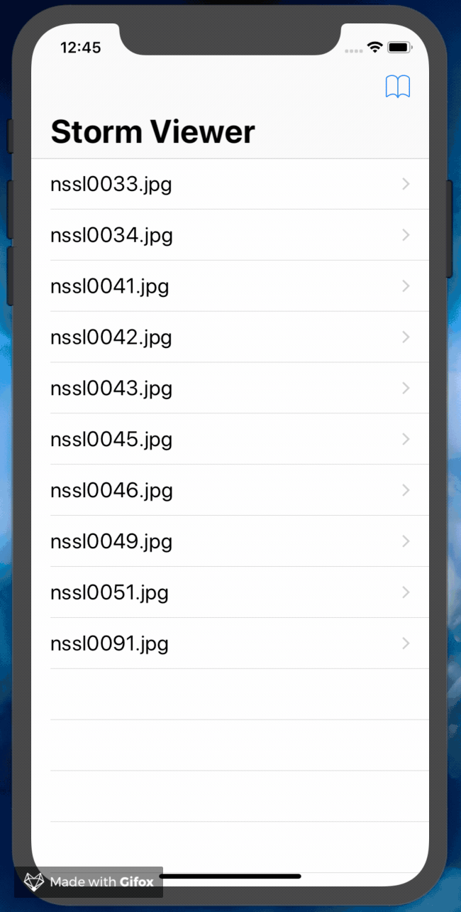

# Storm Viewer

#### Storm Viewer is a projet that contains a UITableView that displays titles of images from a Content file using the FileManager and Bundle, than when a user selects on a particular cell it displays the image using UIImageView and UIImage.

## Main Points:

* UITableView
* UIViewController
* UINavigationController
* FileManager
* App Bundle
* UIImageView
* UIImage
* Storyboard
* Outlets
* AutoLayout

## App Demo:

